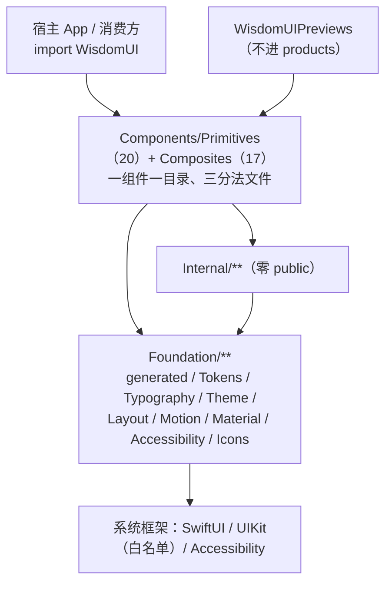
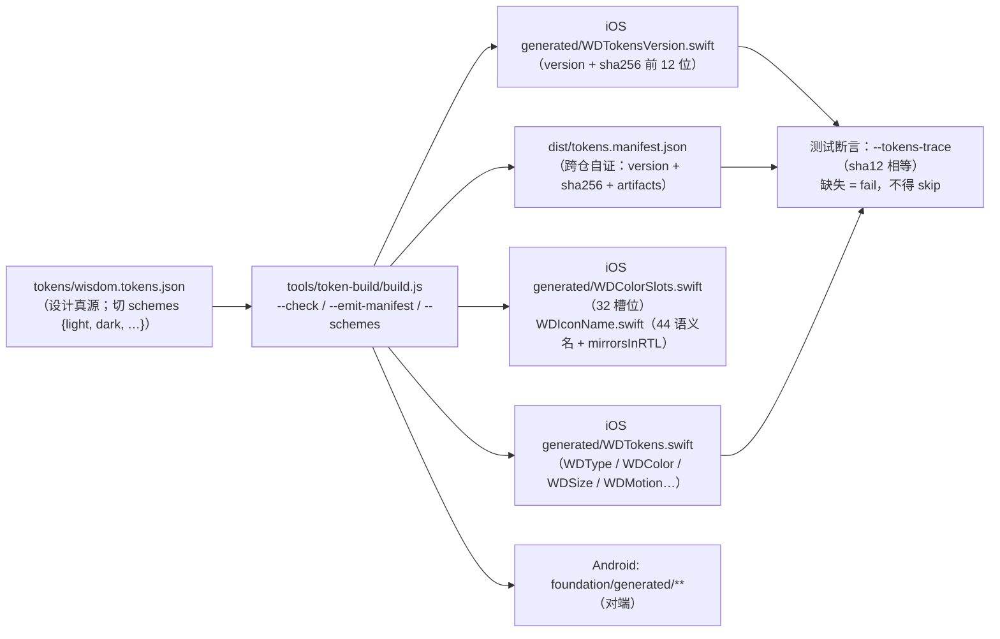
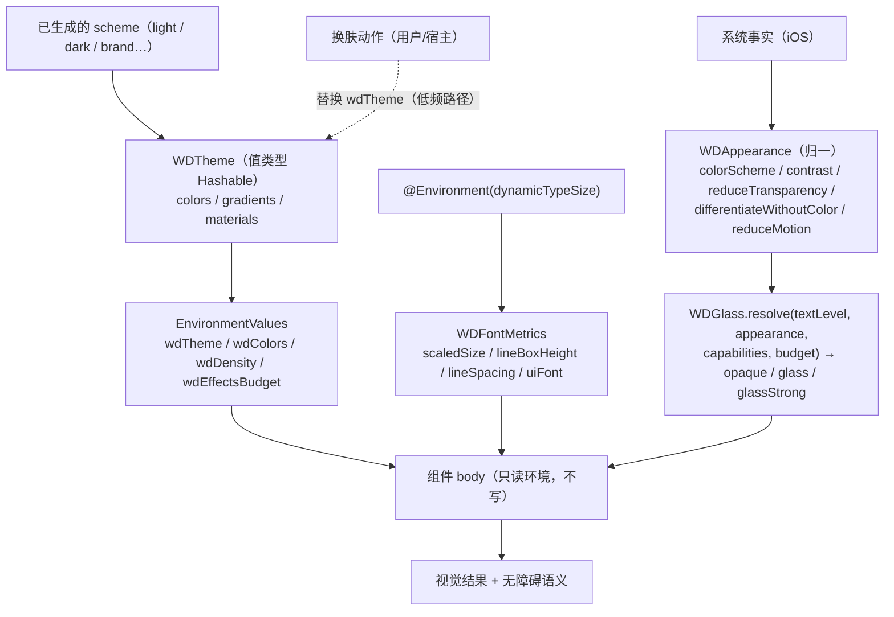
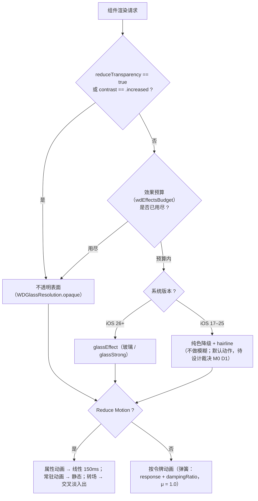
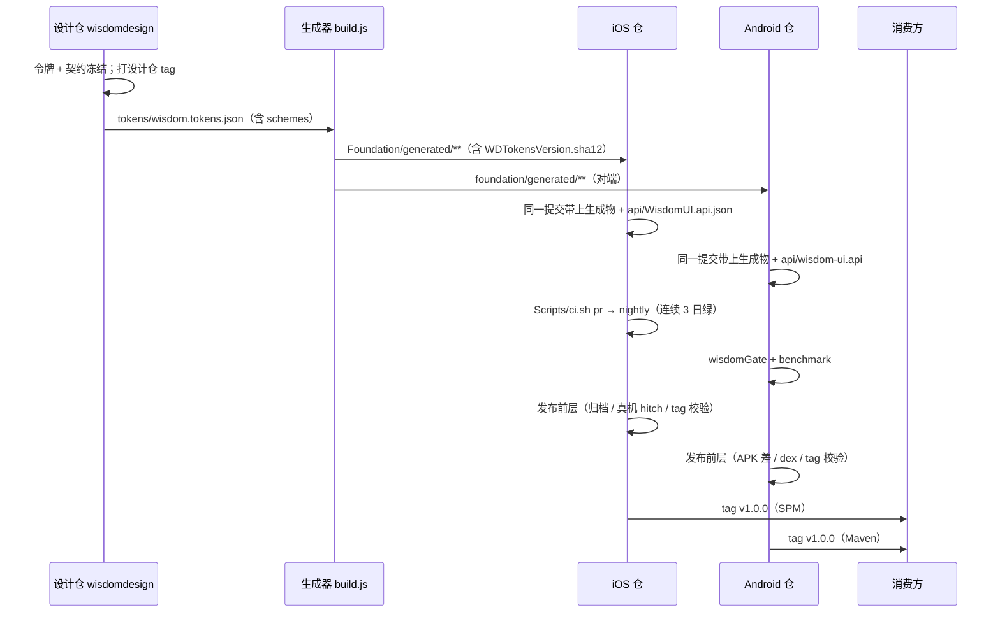
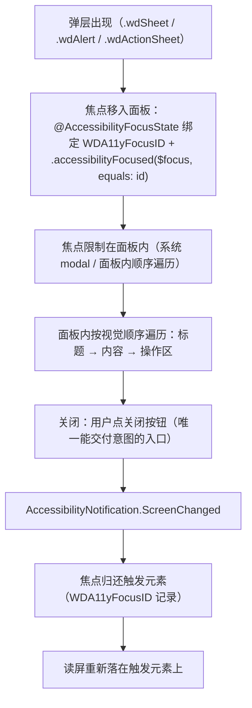

# ARCHITECTURE.md · WisdomUI（iOS）架构参考

> 面向**人 + agent** 的架构参考：只给「结构 + 决策 + 引用」，不复述规格全文。每条关键结论都带来源（本端规格 `SPEC.md` 章节 / 跨端裁决与用户决策（`07`/`08`，**已退役**） / 本仓计划 `DEV-PLAN.md`）。
> **效力顺序（t55 统一、t80 去死链，顺序未改）**：**用户决策**（`08`） ＞ **跨端契约 U/F 裁决**（`07`） ＞ **本端规格 `SPEC.md`**（`02`） ＞ **命名表 `DEV-PLAN.md` §5.3**（`40`，只管名字 / C-15） ＞ **计划与冻结值口径 `DEV-PLAN.md`**（`30`）＞ 本端 AGENTS/ARCH
> **来源与代号约定（t80）**：**跨端工作区文档集已退役**（本端规格已迁 `SPEC.md`，Android 侧为 `android/docs/SPEC.md`）。本文代号：`02`=`SPEC.md`；`30`=`DEV-PLAN.md`；`40`=`DEV-PLAN.md` §5.3（C-15 定名表）；`07`/`08`=跨端裁决与用户决策（结论已冻结在 `DEV-PLAN.md` §5/§6/§7）；`20`/`22`/`24`/`28`=iOS 组长评审链（结论在 `DEV-PLAN.md` §5.1 与本文 §9/§14）；`62`/`63`/`64`/`69`/`71`=仓内文档复核链（结论在 `../AGENTS.md` §8/§12 与 `DEV-PLAN.md` §6）；`12`=Android 规格（`android/docs/SPEC.md`）。
> **设计真源**：设计文档位于**外部设计仓 `wisdomdesign/docs/`**（该仓保留、引用有效）：本文内相对路径为 `../../wisdomdesign/docs/<名>`；后文以其**文件简称**引用（如 `06-accessibility.md`）。
> **分工说明（t55 · XR-01）**：`08`/`07` 定"什么必须两端一致"；`02` 定本端实现形态；`40` **只在命名冲突时**说话；`30` 在"进程/顺序/冻结值口径"上覆盖 `02`（用户 6 条决策后的口径），但**不改 `02` 的实现细节**。冻结值与回写状态见同目录 `../AGENTS.md` §6/§8。
> 图表用 **Mermaid**；**图 1（分层）与图 2（令牌流水线）另给 ASCII 备选**，防止渲染器不支持 Mermaid。
> 术语见 §13；未闭合项见 §12；ADR 摘要见 §11。

## 目录

| 节 | 内容 | 图 |
| --- | --- | --- |
| §1 | 分层与依赖方向 | **图 1** + ASCII |
| §2 | 目录与文件级结构 | — |
| §3 | 令牌流水线与生成物 | **图 2** + ASCII |
| §4 | 主题 · 换肤 · 动态字体 · 高对比度数据流 | **图 3** |
| §5 | 组件模型与状态机 | **图 4** |
| §6 | 渲染与降级决策 | **图 5** |
| §7 | 门禁与 CI 拓扑 | **图 6** |
| §8 | 版本与发布时序 | **图 7** |
| §9 | 无障碍语义映射与焦点顺序 | **图 8** |
| §10 | i18n 与 RTL | — |
| §11 | ADR 摘要表 | — |
| §12 | 未闭合项与风险 | — |
| §13 | 术语表 | — |
| §14 | 待回写（与规格当前文本的差异） | — |

---

## 1. 分层与依赖方向

**决策**：单发布 target `WisdomUI`，内部用**目录分层 + R1–R21 机器检查**强制依赖方向（单 target 内编译器不强制跨目录依赖）（`SPEC.md` §1.1；`07` §2.1）。层方向：`Foundation` ＜ `Primitives` ＜ `Composites`；`Internal` 横切但**不得反向依赖 `Composites`**；`Foundation` 只依赖系统框架（`UIKit` 限 R15 白名单目录）。



**图 1 说明**：依赖只能向下——`Components` 可依赖 `Foundation` 与 `Internal`；`Internal` 可依赖 `Foundation`，**不得**依赖 `Composites`；`Foundation` 只碰系统框架。`Patterns/` 不建（R4）；`Resources/` 不创建（硬约束 5）。检查器三驱动：`Scripts/check-structure.sh`（唯一入口）、build tool plugin（默认静默、M0 不接）、CI 步骤（`SPEC.md` §1.1.1）。

**ASCII 备选（图 1）**

```
  宿主 App                WisdomUIPreviews（不进 products）
     │                            │
     └──────────────┬─────────────┘
                    ▼
   Components/Primitives(20) + Components/Composites(17)
             │                          │
             ▼                          ▼
        Internal/**（零 public）   （同层不得反向依赖 Composites）
             │
             ▼
   Foundation/**（generated/Tokens/Typography/Theme/Layout/Motion/Material/Accessibility/Icons）
             │
             ▼
   SwiftUI / UIKit（仅 Typography 与 Internal 白名单）/ Accessibility
```

**边界与理由**：① 拆多个 product 会让消费方变成多行 import，且不改跨目录依赖仍需脚本（iOS 首轮评审链 `01` §1.1.1-E2；已退役）；② 生成物 `Foundation/generated/**` **必须 public**（消费方读令牌），因此 R6"零 public"只约束 `Internal/`（`SPEC.md` §1.1）；③ host 工具 `wd-structure-check` **不得依赖 `WisdomUI`**，否则 host 编译会撞 218 错（`SPEC.md` §1.1.1）。

---

## 2. 目录与文件级结构

> 结构以 `SPEC.md` §1.1/§1.3 与 `07` §5.1 为准；下表是**文件粒度**视图（不列生成物内容）。

```
iOS/
├── Package.swift                     swift-tools-version 6.1；platforms .iOS(.v17)；products 1 个；零第三方
├── AGENTS.md                         施工手册（先读它）
├── README.md                          安装 + 门禁 + 预览限制（删 swift build/test）
├── CHANGELOG.md                       Keep a Changelog + Breaking 段 + 迁移片段
├── .swift-format                      格式规则（显式列规则；generated/ 走文件清单排除）
├── .github/{workflows/ci.yml, pull_request_template.md, CODEOWNERS}
├── Scripts/{ci.sh, check-structure.sh, check-format.sh, test-checker.sh,
│            dump-api.sh, canonicalize-api.swift, Fixtures/{pass,fail}/**}
├── api/WisdomUI.api.json               规范化符号快照（源码兼容基线）
├── Sources/
│   ├── WisdomUI/
│   │   ├── Foundation/
│   │   │   ├── generated/              仅生成器写：WDTokens.swift / WDTokensVersion.swift /
│   │   │   │                           WDColorSlots.swift / WDIconName.swift
│   │   │   ├── Tokens/                 WDTokenTypes.swift（WDTextStyle 4 存储字段）等手写适配
│   │   │   ├── Typography/             WDFontMetrics.swift / wdFont / WDTypographyMapping.swift
│   │   │   ├── Theme/                  WDTheme.swift / WDColorValues.swift / WDEnvironment.swift / WDAppearance.swift
│   │   │   ├── Layout/                 WDDensity（= WDLayoutDensity）等
│   │   │   ├── Motion/                 WDMotionSpec.swift / WDAnimationModifier.swift
│   │   │   ├── Material/               WDGlassStyle.swift / WDGlassResolve.swift（U10）
│   │   │   ├── Accessibility/          WDSemantics.swift / WDAnnouncement.swift / WDAccessibilityValues.swift
│   │   │   └── Icons/                  仅帮助函数（不打包图标资产）
│   │   ├── Components/{Primitives,Composites}/<Component>/{<Component>.swift, <Component>Style.swift, <Component>+Previews.swift}
│   │   └── Internal/                   WDGlassBackdrop / WDPressFeedback / WDHaptics / WDGlassPlatform 分支等（零 public）
│   ├── WisdomUIPreviews/               共享预览矩阵 + 37 画廊（不进 products）
│   └── wd-structure-check/             host 检查器（只 import Foundation）
├── Tests/
│   ├── WisdomUITests/{Foundation,Components/{Primitives,Composites},Support}   一次渲染多类断言
│   └── WisdomUISnapshotTests/{SnapshotSupport.swift, Baselines/*.png, Baselines/manifest.json}
└── Examples/                                              ← 部分已交付（M0/M1 产出）
    ├── WisdomUIDemo/{WisdomUIDemo.xcodeproj, WisdomUIDemoUITests}     ← planned（M1）
    └── BaselineShell/{BaselineShell.xcodeproj, BaselineShell}          ← 已交付（I-M0-j 空壳基线）
```

**图例**：`← planned（M0/M1 产出）` = **当前尚不存在**，由 M0/M1 任务产出：`Scripts/**`、`.github/**`、`api/WisdomUI.api.json`、`.swift-format`、`CHANGELOG.md`、`CONTRIBUTING.md`、`Sources/WisdomUI/{Components,Internal,APISurface}/**`、`Sources/WisdomUIPreviews/**`、`Sources/wd-structure-check/**`、`Tests/WisdomUISnapshotTests/**`、`Examples/**`。**其余 = 已存在**：`Package.swift`、`README.md`、`LICENSE`、`Sources/WisdomUI/Foundation/{generated/WDTokens.swift, WDColor+Hex.swift, WDTokenTypes.swift}`、`Tests/WisdomUITests/WDTokensTests.swift`（即 M0 前仓内只有"令牌类型 + 生成物"这一层）。

**文件组织纪律**：组件目录**三分法且不许多**（实现 / Style / `+Previews`）；跨组件共享内部件一律落 `Internal/`，**不得**在 `Components/` 下建 `Common/`（`SPEC.md` §1.3）。预览文件由 `#if WD_PREVIEWS` 守卫（**不是 `#if DEBUG`**），release 编译产物零预览符号（`SPEC.md` §1.6；`07` §2.3-3）。

---

## 3. 令牌流水线与生成物

**决策**：令牌**唯一真源** = `../wisdomdesign/tokens/wisdom.tokens.json`（DTCG 格式）；生成器 = `../wisdomdesign/tools/token-build/build.js`；iOS 侧产物 = `Sources/WisdomUI/Foundation/generated/**`（**只允许生成器写**，R12 校验文件头 banner）（`08` §2-1/§2-8；`SPEC.md` §1.2/§1.4.1；`DEV-PLAN.md` §5.1）。
**用户决策 #3/#8 后新增两个维度**：① `WDColorSlot` **32 槽位**（含 `text.disabled`）；② **`schemes: {light, dark, …}`**（多套 scheme + 生成器 `--schemes`）。



**图 2 说明**：三仓一致性不靠人眼——`build.js --check` 保证"同一次生成"；`WDTokensVersion.sha12` 与跨仓 `tokens.manifest.json` 相等保证"同一批"（缺失 = fail）（`SPEC.md` §1.5.4；`DEV-PLAN.md` §2.2-②/⑤）。**改令牌 = 走设计仓变更集 + 三仓同标识提交**，不允许在 iOS 仓手改生成物（`DEV-PLAN.md` §9 三条提交纪律）。

**ASCII 备选（图 2）**

```
wisdomdesign/tokens/wisdom.tokens.json         (设计真源；schemes: light/dark/…)
        │
        ▼
tools/token-build/build.js  --check / --emit-manifest / --schemes
        │
        ├──► iOS  Foundation/generated/WDTokens.swift
        ├──► iOS  Foundation/generated/WDTokensVersion.swift   (version + sha12)
        ├──► iOS  Foundation/generated/WDColorSlots.swift      (32 槽位)
        ├──► iOS  Foundation/generated/WDIconName.swift        (44 语义名 + mirrorsInRTL)
        ├──► Android foundation/generated/**                   (对端)
        └──► dist/tokens.manifest.json                         (version + sha256 + artifacts)
                     │
                     ▼
        测试：--tokens-trace 断言 sha12 相等（缺失 = fail）
```

**生成物纪律**：① **数值型**令牌字段缺省 **emit `0`**（当前仅 `letterSpacing`；不 emit 缺省值歧义）；**非数值字段缺省视为错误**，由 `--check` 报红；② banner 两行含工具版本与令牌 hash，R12 比对；③ `generated/**` 全 `public`（消费方读令牌），因此 `swift-format` 的"公开声明必须有文档"规则要用**显式文件清单排除** `generated/`（`SPEC.md` §1.3/§1.5.1）；④ `WDTextStyle` = 4 存储字段（`size`/`lineHeight`/`weight`/`letterSpacing`），`lineHeightRatio` 与 `textStyle` 是**手写 extension 的只读派生**（不进令牌）（`SPEC.md` §2.1）。

---

## 4. 主题 · 换肤 · 动态字体 · 高对比度数据流

**决策**：令牌是**编译期常量**，运行期只有**槽位覆盖**（颜色/渐变/材质三类）（`08` §2-1；`SPEC.md` §3.1）。**换肤 = 换用已生成的 scheme**（用户决策 #8，层一）：运行时选择一套 scheme 并注入 `wdTheme`；值变化触发受影响子树的**重组/重算**、**不重启进程**；**不支持**运行时任意 `token.json`/服务端下发；`staticCompositionLocalOf` 语义（Android 侧同源风险）提示"切换不得进高频路径"（`DEV-PLAN.md` §5.1；`SPEC.md` §3.2）。



**图 3 说明**：四条数据流在 `EnvironmentValues` 汇合：**主题**（`wdTheme`/`wdColors`，只读派生，唯一解析入口）、**密度**（`wdDensity`，只读；写入口只在 `WDEnvironment.swift` 的修饰符，R18）、**效果预算**（`wdEffectsBudget`，只能降不能升，INT-4）、**动态字体**（`dynamicTypeSize` → `WDFontMetrics` → 行盒）。高对比度两条路径：颜色槽位（`Color` 自带浅/深 + `accessibilityContrast` 通道）与玻璃档位（`contrast == .increased` ⇒ `opaque`）。

**行盒（U5）与语言相关事实**（`SPEC.md` §2.6.3；`DEV-PLAN.md` §5.1）：
- `renderedLineBox = max(设计盒高 × 缩放, natural(script))`；默认档 `abs(rendered − max(设计, natural)) ≤ 0.5pt`；放大档 `≥ ⌈natural × 行数⌉`（不裁切）。
- `natural` 是**语种相关**的：SF Pro ≈ 1.178em；PingFang SC ≈ **1.400em**（组长在 macOS 侧实测，iOS 侧待 fixture 固化 → 见 §12 的 `N-7`）。
- **禁** `Mode.Fixed`/`lineHeightMultiple`（Android 侧措辞）；iOS 侧禁 `minimumScaleFactor`。

**设计侧待给值（M0-1，t60·F-01）**：本节涉及的待给值/待签发项（`motion.duration.reduced` 150 vs 160ms、密度档与行盒口径、换肤 scheme 的对比度账目）——**入口 = `../AGENTS.md` §6.1**（iOS 相关条目 + 默认执行项 + 责任 + 时点），**唯一登记处 = `DEV-PLAN.md` §7**。未到位时按默认执行项冻结，**不得自定值**。

---

## 5. 组件模型与状态机

**决策**：iOS 组件模型 = `View`（结构体 + 泛型内容槽）/ `ViewModifier`（给**外来内容**套外观，不得改交互）/ `ButtonStyle`·`ToggleStyle`（让调用方继续用系统控件拿到设计外观）/ `@Environment`（跨组件共享，禁止单实例状态与业务数据）/ `init` 参数（本实例外观与状态）（`SPEC.md` §2.7）。**弹层不是"什么都不渲染的 View"**，而是修饰符挂在锚点视图（`.wdSheet`/`.wdAlert`/`.wdActionSheet`/`.wdToast`）（`SPEC.md` §2.5；F21/F29）。
**状态机（U6）**：交互态**不进公开 API**（`WDInteractionState` internal，公开面只有 `isLoading` + 平台原语）（`07` §1.2-U6；`SPEC.md` §2.6.1）。

```mermaid
stateDiagram-v2
  [*] --> Default
  Default --> Hover : 指针进入（仅指针设备）
  Default --> Pressed : isPressed（ButtonStyleConfiguration，唯一来源）
  Default --> Focused : 键盘/开关控制焦点
  Default --> Disabled : .disabled(_:) / isEnabled == false
  Default --> Loading : isLoading = true（调用方受控）
  Hover --> Default : 指针离开
  Pressed --> Default : isPressed = false（松手/取消）
  Focused --> Default : 失焦
  Disabled --> Default : 解除 disabled
  Loading --> Default : isLoading = false
  note right of Disabled
    优先级最高且吞输入；
    仍在无障碍树（可被读屏发现）
  end note
  note right of Loading
    忽略 action（不排队）；
    isEnabled 仍为 true；
    保留标签供读屏
  end note
```

**图 4 说明**：**优先级 `disabled > loading > pressed > focused > hover > default`**；`focused`/`hover` 是**叠加维度**（不参与互斥）；`pressed` 唯一来源 = `ButtonStyleConfiguration.isPressed`（禁自造手势）；`loading` 由调用方受控（库内不建计时器）。**错误态与只读态不是"状态"，而是不同数据形态**：错误态走 `.accessibilityValue`（iOS 无 error trait，F22）；只读态 = `Text` + `.textSelection(.enabled)`（在 U6 六态之外，进 acceptance）（`SPEC.md` §2.6.1/§2.6.2）。

**设计侧待给值（M0-1，t60·F-01）**：本节涉及的待给值/待签发项（面板圆角 32、弹层档位与 `WDBottomSheetDetent(s)` 命名、状态"第二信号"形状图标与文案加粗…）——**入口 = `../AGENTS.md` §6.1**，**唯一登记处 = `DEV-PLAN.md` §7**；未到位时按默认执行项冻结，**不得自定值**。

---

## 6. 渲染与降级决策

**决策**：玻璃在 iOS 26+ 用 `glassEffect`；**iOS 17–25 = 纯色降级**（**不做模糊、不使用系统 `Material` 模糊**，保留 hairline）——**默认动作，待设计裁决（时点 M0 D1）**，裁决入口 = `DEV-PLAN.md` **§7** 的 DF-10 行（t60 · F-02 / `63` DF-10）；`reduceTransparency` 或 `contrast == .increased` ⇒ **不透明**（U10）；效果用量受 `wdEffectsBudget` 约束（只能降不能升）；**库内不覆写平台设置**（R16）（`08` §2-6；`SPEC.md` §3.2/§3.5；`DEV-PLAN.md` §5.1）。
**快照/渲染器必须显式分表**：普通组件用 `ImageRenderer`；**玻璃类 6 个**（`WDBottomSheet`/`WDActionSheet`/`WDTabBar`/`WDNavigationBar`/`WDToolbar`/`WDCard(.glass)`）用 `UIHostingController` + `drawHierarchy`（`ImageRenderer` 不渲染 `Material`/`glassEffect`）（`SPEC.md` §1.6）。



**图 5 说明**：`D3` 的 iOS 17–25 分支 = **纯色降级**（默认动作；**若设计在 M0 D1 裁定采用系统 `Material`**，则按 `DEV-PLAN.md` §7 的 DF-10 行更新，并回到"玻璃类 6 个组件用 `UIHostingController`+`drawHierarchy`"的快照口径）。
三级决策顺序 = **无障碍设置 ＞ 效果预算 ＞ 系统版本**；任何一级要求降级都不再"偷偷用玻璃"（`WDGlass.resolve` 是唯一入口，组件不自选档）。Reduce Motion 降级只覆盖库内可归一的三类；**页面转场归宿主 App**（库不接管）（`SPEC.md` §3.2/§3.5）。

**玻璃档位 × 文字可用（**DF-02**，t57 补录）**：设计侧有**六档**（`material.ultraThin 14/.38`、`thin 22/.54`、`regular 30/.70`、`thick 44/.86`、`tinted`（品牌染色 24–30%）、`sheen`（3800ms 高光）；真源 = `wisdomdesign/docs/01-foundation.md` §7.2），其中**消费层两档逐位相等**：`surface.glass ≡ material.regular`、`surface.glass-strong ≡ material.thick`（生成期断言，`12-b22-glass.md` §3）。"玻璃上能放什么字"由档位决定（`06-accessibility.md` §5.2）：

| 语义档 | 允许的文字级别（**最不利**口径） |
| --- | --- |
| 浅色 `glass` | **仅 `text.primary`**（`secondary` 3.6 ❌ / `tertiary` 3.1 ❌） |
| 浅色 `glass-strong` | `primary` / `secondary` / `tertiary` 全可用 |
| 深色 `glass` | **零字阶都不上**（连 `primary` 只有 4.1 ❌） |
| 深色 `glass-strong` | **仅 `text.primary`**（`secondary` 4.2 ❌ / `tertiary` 2.9 ❌）；悬浮 Tab 栏走 `glass-strong`，**深色 Tab 栏改用不透明表面**（`12-b22-glass.md` §7 方案 A） |

另两条：**语义色（`status.*`）不上玻璃**；`tinted` / `sheen` 属**强调容器 / 装饰**，**不作为玻璃文字载体**。落地口径：`WDGlass.resolve` 的 `textLevel` 即载体，六档只作**额外输入**、不改输出语义与签名（`02` **F47**；冲突以 `02` 为准）。
**效果配额（**DF-03**，t57 补录）**：跨端工作区文档集的性能讨论稿（`03-perf-release`，已退役）§1.2 的 **7 条硬上限**——① 玻璃**同屏 ≤1 个模糊面、列表项内 0**；② 色晕 `wash` 每屏 1 处且禁止动画（一次绘制画 3 段 radial）；③ `sheen` 每屏 ≤1；④ 骨架微光**同屏 ≤6**；⑤ `e3` 每屏 ≤1（列表项 `e0/e1`）；⑥ 进度环/下拉环**每屏 ≤1 个动画环**；⑦ 触觉同一次操作 1 次。违反时一律走降级（`opaque` / 静态 / 停动画），**不是降速**；`wdEffectsBudget` **只能降不能升**（R18）；"同屏模糊面数量可数"是规格侧要求的可勾选验收。
**行距（F51）**：列表行**行距各端自由**——iOS 44 / Android 布局盒 48；**统一项 = 两端可见内容高度 44 ± 0.5**；**不得给 iOS 加 4pt 内边距**（登记处 = iOS 组长评审链 `20` §3-附记「第 3 批补记 · F51」；**现口径 = `DEV-PLAN.md` §5.1 的 F51 行**）。
**设计侧待给值 / 待签发**：唯一登记处 = `DEV-PLAN.md` **§7**（本仓计划的设计待给值节）；条目索引 = 设计侧核对链 `63` §3 的 DF-02 / DF-03 / DF-04；逐项清单正文随跨端工作区退役（**本页不复写**）。

---

## 7. 门禁与 CI 拓扑

**决策**：三层门禁（PR 必过 / nightly / 发布前），命令一律 `xcodebuild` + 模拟器；**PR 只编模拟器一张编译图**（设备编译下沉 nightly）；destination 按 **UDID** 解析；scheme 名首次跑通后固化（候选 `WisdomDesign-iOS-Package`）；覆盖率必须有 `-enableCodeCoverage YES -resultBundlePath` 才有输入；**门禁日历**（每批 nightly 连续 3 日绿）= `DEV-PLAN.md` §2.1 的 `+3 工作日/批`（`07` §6.4；`SPEC.md` §1.5.1/§1.5.2；`DEV-PLAN.md` §2/§3.4）。

```mermaid
flowchart LR
  P0["PR-0（host，秒级）<br/>check-structure.sh（R1–R21）<br/>check-format.sh"] --> P1
  P1["PR-1（模拟器，一次会话）<br/>build-for-testing（含 WD_API_SMOKE）<br/>→ test-without-building（WisdomUITests）<br/>+ xccov 覆盖率"] --> P2
  P2["PR-2（复用 DerivedData）<br/>dump-api.sh + git diff --exit-code --<br/>api/WisdomUI.api.json"] --> N1
  N1["nightly-1<br/>设备编译（generic/platform=iOS）"] --> N2
  N2["nightly-1 六态快照<br/>WisdomUISnapshotTests"] --> N3
  N3["nightly-2<br/>demo 无障碍审计（4 类目，XCUITest）<br/>M1 交付物，M1 前不可跑"] --> N4
  N4["nightly-3<br/>模拟器相对量性能 → .build/perf/{date}.json"] --> R1
  R1["发布前<br/>真机 hitch + 首帧"] --> R2
  R2["发布前<br/>归档 Thinning 增量 + tag 校验"] --> Done["批出口 / 发布出口"]
```



**图 6 说明**：PR 三个 job 串行且**共用一次编译**（IOS-10：不再有第二次 `xcodebuild build`）；nightly 才做设备编译与快照；**nightly-2（demo 无障碍审计）是 M1 交付物**——M1 前 `Examples/WisdomUIDemo/` 与 `WisdomUIDemoUITests` 都不存在，该节点**不可跑**，只能标【未验证】；命令形式 = `xcodebuild test -project Examples/WisdomUIDemo/WisdomUIDemo.xcodeproj -scheme WisdomUIDemo -destination "$WD_SIM_ID" -only-testing:WisdomUIDemoUITests`（见 `../AGENTS.md` §5.2）；发布前层才是**真机**指标（模拟器不产生真实 hitch）。**未回填前一律标【未验证】**：scheme 名、PR-0/1/2 真实耗时、覆盖率报告、金标设备（`28` §5；`DEV-PLAN.md` §10；`AGENTS.md` §7）。**预算回填责任 = ios-lead，时点 = M0 出口前**（`SPEC.md` §1.5.2/IOS-16）。

**门禁强度与出口**：批出口 = 该批判据集合（`DEV-PLAN.md` §2.3）全绿 **且** nightly 连续 3 日绿；出口判据一律命令化/文档化，**不使用完成度百分比**（`DEV-PLAN.md` §1）。

---

## 8. 版本与发布时序

**决策**：**三层版本**（令牌数据 / 契约 / 库）；**SPM tag 只增不改**（打错发 `v1.0.1` 并在 CHANGELOG 标注废弃版本）；发布顺序 = **设计仓冻结并打 tag → 生成 → 两端提交（含快照）→ 两端跑绿 → 发布前层 → 双端同 tag**（平台 tag 永远在最后）（`08` §2；`DEV-PLAN.md` §10）。



**图 7 说明**：**任何一步红了都不进入下一步**；跨仓依赖靠"设计仓 tag + `tokens.manifest.json`"自证（§3 图 2）。**变更节奏**（`DEV-PLAN.md` §10）：单批变更 = 一个 PR + 一次批前冻结 + 一次批出口评审；**签名冻结后改签名 = 走 U 项变更流程**（先改真源，再同步副本）。

---

## 9. 无障碍语义映射与焦点顺序

**决策**：库内**零文案**——读屏标签由调用方传入，库只提供**结构拼接原语**（`WDSemantics.join/positional`：零标点、零语序）；播报走 `@MainActor WDAnnouncing`；**错误态无 iOS error trait** ⇒ `.accessibilityValue` 或 `.accessibilityHint`（分隔符与文案由调用方给，F22）；焦点身份用 `WDA11yFocusID: Hashable, Sendable`（`@AccessibilityFocusState` 需要 `Value: Hashable`，用 `Text` 编译不过）（`08` §2-5；`SPEC.md` §2.6.2；`DEV-PLAN.md` §5.1）。



**图 8 说明**：焦点标记必须写全 **`.accessibilityFocused($focus, equals: id)`**——**值形态必须带 `equals:`**，只有 `Bool` 形态（无参重载）才可省略；`WDA11yFocusID` 必须是 `Hashable`（用 `Text` 之类的非 `Hashable` 值编译不过；`SPEC.md` §3.6 已有该纪律，IOS-04 实测过）。
iOS **只能交付"已关闭"与"点了关闭按钮"**（`onDismiss`/`onCloseButtonTap`），**没有"遮罩点击意图"回调**（F29）；"下滑关闭"必须给**自定义辅助操作**，不能只依赖手势（`SPEC.md` §2.5）。焦点顺序与语义映射表见下。

| 组件族 | 语义映射（iOS） | 焦点/顺序要点 | 来源 |
| --- | --- | --- | --- |
| 按钮（`WDButton`/`WDIconButton`） | 真 `Button` + `.accessibilityLabel`；`isLoading` 期间保留标签、`loadingAccessibilityText` 必填（`requiredWhen: loading`） | 焦点按视觉顺序；图标按钮标签**必填** | `SPEC.md` §2.2/§2.9 |
| 文本字段（`WDTextField`） | `label` 必填（常驻）；错误态 = `.accessibilityValue(值 + 分隔符 + 错误文案)`；`helper` 与 `accessory` 四选一 | 只读态（`Text` + `.textSelection`）在六态之外 | `SPEC.md` §2.3/§2.6.2 |
| 列表（`WDListRow`/`WDListSection`） | 整行一个元素；`action == nil` ⇒ 不设 `.isButton`、不可聚焦；滑动删除提供 `.accessibilityAction(named:)` | 分隔线不进树；行高 = 可见内容 44（两端同值，U） | `SPEC.md` §2.4；`DEV-PLAN.md` §5.1 |
| 进度（`WDProgressBar`/`WDProgressRing`） | 无原生 progressbar trait ⇒ `.accessibilityValue` + 频控播报（只跨 25/50/75/100） | 不确定态（`value == nil`）不播报数值 | `SPEC.md` §2.6.1 |
| 弹层（Sheet/Alert/ActionSheet/Toast） | 焦点陷阱 + 归还；`closeButtonAccessibilityLabel` 必填（库不推导"关闭"）；Toast 计时支持 ≥5000ms | Toast 暂停=继续剩余时间；切换主题不受影响 | `SPEC.md` §2.5（弹层形态与无障碍）+ **`SPEC.md` §1.4.1-#15**（Toast 停留上限 ≥5000ms，**tech-lead CR-3 已裁**）；**修正**：原引的 `DEV-PLAN.md` §6-P8 是"32 槽位/`text.disabled`"条目，与 Toast 无关（t55 · XR-14） |
| 图标（`WDIcon`） | 默认装饰（`.accessibilityHidden(true)`）；需要语义时给 `accessibilityLabel` | 装饰不进树 | `SPEC.md` §2.10-#20 |

**对比度硬门槛（**DF-04**，t57 补录；真源 = `wisdomdesign/docs/06-accessibility.md` §5.1 + §5.2 规则 6）**：

| 内容 | 下限（硬） |
| --- | --- |
| 正文（< 18.66pt 粗体 / < 24pt） | **4.5:1** |
| 大字号（≥ 18.66pt 粗体） | **3:1** |
| 图形、图标、控件边界 | **3:1** |
| 禁用态 | 不适用（可辨识即可）——**40% 不透明度** |
| 焦点光环 | **3:1（对相邻色）** |

**验收口径（关键）**：测**最不利位置的背景色**，**不是取平均**；**玻璃一律取"最暗内容"或"最亮内容"的合成色**。玻璃上的已知不达标面（`06` §5.2 的实算）：浅色 `glass` 上 `secondary` 3.6 ❌ / `tertiary` 3.1 ❌；深色 `glass` 连 `primary` 4.1 ❌；深色 `glass-strong` 上 `secondary` 4.2 ❌ / `tertiary` 2.9 ❌ —— 与 §6 的文字可用矩阵是同一件事的两种表述。
**iOS 验收方式**：① 每套 scheme 的对比度账目进 `contracts/contrast.json`（`DEV-PLAN.md` §5.1 出口判据）；② nightly 的 demo 无障碍审计 4 类目之 **`contrast`** 必须**最不利取色**；③ §6 的玻璃矩阵单测；④ `contrast == .increased` ⇒ 玻璃**不透明**（O-9 第 1 条；第 2/3 条排 M4 且需设计签发）。

---

## 10. i18n 与 RTL

| 项 | 决策 | 来源 |
| --- | --- | --- |
| 载荷类型 | 用户可见文案一律 `Text`（`LocalizedStringKey` 走调用方 bundle）；不做 `String` 拼接 | `08` §2-5；`SPEC.md` §3.7 |
| 库内文案 | **零文案**（L-B）：库不提供任何默认字串；`WDSemantics` 零标点/零语序 | `08` §2-5 |
| 复数/格式化 | **库不做**（复数、数字、日期格式化归调用方/系统） | `SPEC.md` §3.7 |
| 语言清单 | M0 只 `zh-Hans` + `en`；`ar` 仅作 RTL 验证语言（不承诺完整交付） | `08` U9 |
| RTL 方向 | 只用 `leading`/`trailing`，**禁** `left`/`right`（N14）；布局方向由系统 `layoutDirection` 推导 | `SPEC.md` §3.7 |
| RTL 图标 | **不读 `mirrorsInRTL` 渲染**：依赖 SF Symbols 自带镜像元数据；`mirrorsInRTL` **只用于契约断言与测试** | `08` §2-4；`SPEC.md` §3.7 |
| RTL 几何 | 品牌渐变与色晕**不镜像**（令牌里是物理坐标） | `SPEC.md` §3.7 |
| 相对日期 | 不用 `RelativeDateTimeFormatter` 的相对量（会输出"1 天后"，与文案规范冲突）；用绝对/半绝对模板 | `SPEC.md` §3.7 |
| 验证矩阵 | 六态截图含 LTR/RTL 两态（浅/深 × 默认/AX3 × LTR/RTL） | `SPEC.md` §1.6 |

---

## 11. ADR 摘要表

> 只摘与本仓代码结构直接相关的决策；每条给"结论 + 理由一句话 + 来源"。

| # | 决策 | 结论 | 理由（一句话） | 来源 |
| --- | --- | --- | --- | --- |
| A-01 | 仓库形态 | **保留三仓**（不搬 monorepo） | 受管文件少、工作树小；真正要修的是跨仓写入（已改为变更集流程） | `08` U1 |
| A-02 | 模块形态 | **单发布 target `WisdomUI`**，目录分层 + R1–R21 检查 | 拆 product 让消费方多行 import，且不改依赖仍需脚本 | iOS 首轮评审链 `01`（已退役） §1.1.1-E2；`SPEC.md` §1.1 |
| A-03 | 组件模型 | `View` + `Style` 协议 + `ViewModifier` + `@Environment` | 交互态唯一来源必须是平台原语，否则 37 组件各写一套 | `07` §1.2-议题 4；`SPEC.md` §2.7 |
| A-04 | 状态优先级 | `disabled > loading > pressed > focused > hover > default` | 两端必须一致，否则行为不可比 | `07` §1.2-U6 |
| A-05 | 行盒语义 | `max(设计盒高×缩放, natural(script))`（带容差） | 中文字体自然行高 1.400em 会让"默认=设计值"在 12 档全部不成立 | `DEV-PLAN.md` §5.1；`SPEC.md` §2.6.3 |
| A-06 | 行高/热区 | 可见内容 **44 两端同值**；Android **布局盒 48**（+2×2dp）；U = 可见 44±0.5；F = 行距 48/44 | 用户裁决案 B：视觉一致、Android 纵向节奏疏 4dp | `DEV-PLAN.md` §5.1/§6-P7 |
| A-07 | 弹簧 | canonical `response` + `dampingRatio`，`stiffness = μ·(2π/response)²`，μ = 1.0 | 两端物理等价；iOS 不生成 `stiffness` | `08` §2-3 |
| A-08 | 图标 | 只统一语义名 + `mirrorsInRTL`；iOS 按名取 SF Symbols | 平台能力不同（Android 无按名取符号） | `08` §2-4 |
| A-09 | 文案 | L-B：库内零资源 + 零文案；读屏标签调用方传入 | 否则破坏"零资源 + 零依赖"两条基线 | `08` §2-5 |
| A-10 | 玻璃 | iOS 26 `glassEffect` / 17–25 材质降级；`WDGlass.resolve` 唯一入口 | Android 无背景模糊等价物 ⇒ 必须允许降级 | `08` §2-6；`SPEC.md` §3.2 |
| A-11 | 分发 | **SPM 源码分发**；tag 只增不改 | 源码兼容 vs Android ABI 兼容的判定不对称 | `08` §2；`DEV-PLAN.md` §10 |
| A-12 | 门禁 | `xcodebuild` + 模拟器；`swift build/test` 不作门禁 | 本包只声明 iOS 平台，host 编译必然失败（218 错） | `08` §2-7 |
| A-13 | 换肤 | 层一：多套生成 scheme + 运行时选择；不支持运行时任意 token/服务端下发 | 冻结窗口只开一次 ⇒ scheme 维度必须一次进 schema | `DEV-PLAN.md` §5.1（用户决策 #8） |
| A-14 | API 冻结 | 规范化符号快照入库（丢 USR/路径/docComment）；M0-11 签名冒烟 | 原始 symbolgraph 随编译器漂移，门禁会被绕过 | `SPEC.md` §1.5.3/§1.2.2 |
| A-15 | 契约与命名 | C-15 受控值名唯一表；U3 槽位 21 名；M0-5 起真源迁 `contracts/README.md` | 副本各自长编号会分叉 | `40`；`DEV-PLAN.md` §9 |

---

## 12. 未闭合项与风险

> 与 `AGENTS.md` §7 同源；此处按"架构影响"排序，只列会影响结构决策的项。

### 12.1 未验证项（**编号与 `../AGENTS.md` §7 完全一致**；ARCH 不另起编号）

| AGENTS §7 编号 | 项 | 影响 | 回填 | 时点 |
| --- | --- | --- | --- | --- |
| **U-01** | `xcodebuild` 全链路未跑通（scheme、耗时、覆盖率） | PR 门禁当前无法执行；`ci.sh` 的 destination/scheme 解析未验证 | ios-lead | M0 出口前（阻塞） |
| **U-02** | M0-11 签名冒烟未 CI 级实跑 | 公开面编译错误可能拖到 M2 才发现 | ios-lead | M0 出口前（阻塞） |
| **U-03** | 字体自然行高 iOS 侧未实测（SF/PingFang 的 em 比值来自 macOS 测量） | 行盒验收与 `LanguageLineBoxFixture` 无法固化 | ios-dev | M1 出口前 |
| **U-04** | AX3 ≈ 175% 未实测 | 动态字体验收档（U5/U7）无法定值 | ios-dev | M1 出口前 |
| **U-05** | 真机 fontScale 2.0 观感与缩放手感（原 `28` §5 的 V1） | U7 上界验收无法定值 | 两端 | M1 出口 |
| **U-06** | 快照渲染器/**金标设备矩阵**未定 | nightly 快照跨机器会 flap | 两端 + tech-lead | M1 前 |
| **U-07** | 三枚举（`WDCardStyle`/`WDToastVariant`/`WDBannerVariant`）与 `WDCheckbox.isChecked` 改名的 CI 级编译验证 | 改名风险拖到 M2 才暴露 | ios-dev | M0/M2 交界 |
| **U-08** | SPM `Package.resolved` pin 后"移动 tag"的失败模式 | 发布纪律只有政策、没有实测依据 | ios-lead | M6 发布前 |
| **U-09** | **归档体积增量与体积门槛值**（`docs/SPEC.md` 的 E3-iOS-a/b；M3 出口"体积门槛值定"目前只是待定项） | 发布前层的体积断言（`xcodebuild archive` + Thinning 增量）无法执行 | ios-lead | **M3 出口** |

> 编号规则：**只用 `AGENTS.md` §7 的 U-xx**——ARCH 原先的 `N-01/N-02/N-07/N-09/N-01b` 已并入上表（N-01b 属无来源编号，已删除）。`28` §5 的【待实测】清单是本源。

### 12.2 风险与未决（**不在 `AGENTS.md` §7 的【未验证】清单内**；来源 = `DEV-PLAN.md` §8/§8.1）

| # | 项 | 影响 | 归属 | 时点 |
| --- | --- | --- | --- | --- |
| R-07 | `staticCompositionLocalOf` 值不稳 / 主题切换进高频路径 | 整树重组、掉帧（不报错） | android-dev + 两端 | M1 |
| R-16 | 设计侧"给值"无 SLA | M0-1 冻结窗口只开一次 ⇒ 二次 breaking 风险 | 设计 + 架构师 | M0 D1 |
| R-18 | `Q-I18N-2` 降级 | M0 只产 `l10n-fixtures.json`；字符串真源排 M2 之后 | 设计 | M2 之后 |
| O-01 | 架构师 / 设计**未点名到人** | M0 出口 ②③④ 与 M2 批前冻结可能顺延 | 用户/船长 | M0 D1 之前 |

**纪律**：以上未闭合项在回填前**不得**在代码注释/README/CHANGELOG/PR/出口报告里写成"已通过"（`SPEC.md` §8.2；`DEV-PLAN.md` §8）。

---

## 13. 术语表

| 词 | 含义 | 出处 |
| --- | --- | --- |
| **U 系列** | 必须两端统一的项（名字/取值/可观测行为） | `07` §1.2 |
| **F 系列** | 各端自由的项（由平台 API 形状决定），但必须在契约登记两端形态。**F1–F20** 在 `07` §1.3；**F21–F50 真源 = iOS 组长评审链（`20`，已退役）§3 + §3-附记**；**现口径 = `DEV-PLAN.md` §5.1**；**F51 起**由研发 Leader 在同一附记分配（行距 = **F51**，t53） | `07` §1.3（仅 F1–F20）；iOS 组长评审链 `20`（已退役） §3+附记（F21–F51） |
| **C-15** | 受控值参数名唯一表（37 行：iOS 名 / Android 名 / 契约名） | `DEV-PLAN.md` §5.3（已内联 37 行；含改名台账：#06 = `isChecked`） |
| **M0-1** | 令牌 schema 的一次性冻结变更集（含 21 行清单 + `schemes` 维度 + 32 槽位） | `SPEC.md` §1.4.1；`DEV-PLAN.md` §5.1 |
| **批前签名冻结** | 每批第 0 步：该批组件签名 + `contracts/<c>.yaml` 入库后才允许开工 | `DEV-PLAN.md` §3 |
| **M0-11 签名冒烟** | `#if WD_API_SMOKE` 下逐字复制的公开声明（只放尚未实现的），随 PR-1 同一次编译验证 | `SPEC.md` §1.2.2 |
| **布局盒 / 可见内容** | Android 行布局盒 48 = 可见内容 44 + 上下各 2dp 透明内边距；热区 = 布局盒 | `DEV-PLAN.md` §5.1 |
| **scheme** | 令牌里的一套语义色值（`light`/`dark`/品牌…）；换肤 = 换已生成的 scheme | `DEV-PLAN.md` §5.1 |
| **门禁日历** | 每批 nightly 连续 3 日绿（计入 `+3 工作日/批`） | `DEV-PLAN.md` §4.5/§2 |
| **`V1` vs `V-1`**（**易混，t60·D5 消歧**） | **两个不同东西**：`V1` = 真机 `fontScale 2.0` 观感 / 缩放手感（原 `28` §5 的待实测项，对应本页 §12.1 的 **U-05**）；`V-1` = **`DEV-PLAN.md` §8 台账**里的"iOS scheme test action 接线"项。引用必须带限定语（"真机观感 V1" / "台账 V-1"） | `28` §5；`DEV-PLAN.md` §8 |
| **DF-10 / DF-14（设计待裁决）** | `DF-10` = iOS 17–25 玻璃降级口径（**默认 = 纯色降级**）；`DF-14` = `motion.duration.reduced`（**默认 = 150ms**）。两者均**待设计裁决**，登记处 = `DEV-PLAN.md` §7 | `63` §3；`DEV-PLAN.md` §7 |
| **P7–P10** | 决策生效后的规格/设计文档回写项（本端规格 `SPEC.md`、Android 规格、设计仓 `09-layout.md`） | `DEV-PLAN.md` §6 |
| **L-B** | 库内零资源 + 零文案 | `08` §2-5 |
| **U5 行盒 / U6 状态 / U8 触控 / U10 玻璃 / U12 语义色** | 跨端契约里的对应条目 | `07` §1.2 |
| **R1–R21** | 本仓结构/依赖/字面量/文案规则表（检查器唯一入口 `Scripts/check-structure.sh`） | `SPEC.md` §1.1.2 |

---

## 14. 与规格文本的差异（**已回写，截至 t55**）

> 口径来源统一 = **`DEV-PLAN.md` §5/§6**；`SPEC.md` / Android 规格 / 设计仓 `09-layout.md` 的对应条目按 `DEV-PLAN.md` §6 的 **P7–P12（+P10）回写**。**本表按 t55 实测收敛为"已回写"，每行给锚点**（跨端工作区文档集的交叉复核 **XR-02**）；仍开放的行带时间点与责任人。**实现只认"最终值"**；同节内容与 `AGENTS.md` §8 一致（两份文档口径必须同步）。

| # | 位置 | 最终值（只认这个） | **状态 / 回写项**（与 `AGENTS.md` §8 逐行对齐） |
| --- | --- | --- | --- |
| D-01 | `SPEC.md` §1.4.1 第 3 行（行高） | `size.row-height.{comfortable,compact}` = **60 / 44 单值键（两端同值）**；Android 的 48 = 布局盒（44 可见 + 上下各 2dp 内边距） | **已回写（t55 · P11）**：`SPEC.md` §1.4.1-#3 = 单值键 + 布局盒注明（授权 = `DEV-PLAN.md` §6 `:479`） |
| D-02 | `SPEC.md` §1.4.1 第 17 行（disabled） | 新增 **`text.disabled`** ⇒ **U12 = 32 槽位** | **iOS 已回写（t43）**：`SPEC.md` §1.4.1-#17 = 已决 (a)/32；`12` 侧 = P8（android-lead） |
| D-03 | `02`/`12` 全文（scheme） | 令牌含 **`schemes: {light, dark, …}`** + 生成器 `--schemes`；运行时换已生成 scheme、不重启、不进高频路径；不支持运行时任意 token/服务端下发 | **两端已回写（t43）**：`SPEC.md` §3.2 `:1021-1023`（+尾部 `:1506`）；`12:1314`、`:1320-1321` |
| D-04 | `../../wisdomdesign/docs/09-layout.md:101` | "整行 = **48 布局盒**（可见 44 + 上下各 2dp 内边距）" | **P10 待回写（设计侧，t55 不核）**：落地前以本表"最终值"列为准 |
| D-05 | `12` 行高/热区 10 处 | 可见内容 44（两端同值）+ 布局盒 48；AR-67 断言值不变；新增"可见内容 44 ± 0.5"断言 | **P7（android-lead，t55 不核）**；iOS 侧无对应改动（`02` 行高键形由 **P11** 覆盖） |
| D-06 | `SPEC.md` §6.1-7 / §9.3-6 / §9.2-I-M0-i / §5-I45（pathspec） | 仓内正确形式 `git grep -nE 'swift (build\|test)' -- . \| grep -v -- '-product wd-structure-check'`（**不是** `-- iOS/`） | **已回写（t53 · P12；早前 t46 已改 `02` 四处）**；t46 直改属**船长一次性授权、不构成先例**（`DEV-PLAN.md` §6 · XR-12） |

> 若发现规格里仍有旧写法：**不要改规格**（跨仓只读）——在 PR 描述登记并 @ios-lead，由计划侧走 `DEV-PLAN.md` §9 的真源流程。

---

> 本文是 `t34` 的产物，只读参考。图表以 Mermaid 为准；图 1（分层）与图 2（令牌流水线）另给 ASCII 备选。施工顺序与命令见 `../AGENTS.md`。
